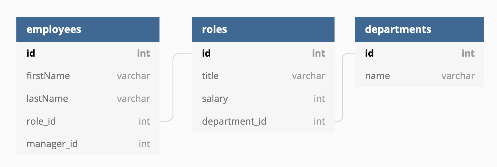

# Employee Manager

## Summary
Employee Manager is a CLI app for managing human resources. You can add, edit, and delete employees, departments, and roles, and manage the associations between them. See the [database schema](#database-schema) for more information about how it all works together.

## Prerequisites
* [NodeJS](https://nodejs.org/)
* [MySQL](https://dev.mysql.com/downloads/mysql/)

## Installing

Run the following commands in your preferred CLI to install the Node package and all dependencies:

```bash
git clone https://github.com/amandalatkins/employee-manager.git
cd employee-manager
npm i
```

Create a new file called `.env` that will store your MySQL server information:

```bash
touch .env
```

Format the contents of `.env` as follows, substituting your MySQL server information where applicable:

```
DB_HOST=localhost
DB_PORT=3306
DB_USER=username
DB_PASS=password
```

Import the database schema and optional demo data:

```bash
#login to mysql
mysql -u username -p

#import the required schema
source schema.sql

#import the optional demo data
source seeds.sql
```

Start the application by using the following command:

```bash
node index.js
```

## Application Preview:


## Database Schema



## Code Snippets

The following code snippet shows the MySQL queries that are run in the `showAll` function to display employees, roles, and departments with corresponding information from other the other tables.

```javascript
var showAll = (table_name,callback) => {
    let query = "";
    if (table_name === "employees") {
        // Show all employees first name, last name, role, salary, department, and manager name
        query = `SELECT emp1.firstName AS 'First Name', emp1.lastName AS 'Last Name', title AS 'Title', name AS 'Department', salary AS 'Salary', GROUP_CONCAT(DISTINCT emp2.firstName,' ', emp2.lastName) AS 'Manager'
        FROM employees emp1
        JOIN roles ON emp1.role_id = roles.id
        JOIN departments ON roles.department_id = departments.id
        LEFT JOIN employees emp2 ON emp1.manager_id = emp2.id
        GROUP BY emp1.id
        ORDER BY emp1.lastName ASC`;
    } else if (table_name === "roles") {
        // Show all roles with corresponding department and number of employees in each role    
        query = `SELECT title AS 'Position', name AS 'Department', salary AS 'Salary', COUNT(employees.role_id) AS 'Total Employees'
        FROM roles
        LEFT OUTER JOIN departments ON roles.department_id = departments.id
        LEFT OUTER JOIN employees ON employees.role_id = roles.id
        GROUP BY roles.id
        ORDER BY title ASC`;
    } else if (table_name === "departments") {
        // Show all departments with number of roles in each department
        query = `SELECT name AS 'Department', COUNT(roles.department_id) AS 'Total Roles'
        FROM departments
        LEFT OUTER JOIN roles ON roles.department_id = departments.id
        GROUP BY departments.id
        ORDER BY name ASC`;
    }

    db.query(query,table_name,(err,res) => {
        if (err) throw err;
        console.log('\n');
        console.table(res);
        callback();
    });
}
```

## Learning Points:
* I spent a lot of time reading up on MySQL `JOIN`, `COUNT`, and `GROUP_CONCAT` statements to effectively connect the different points of data from the different tables in the manner I desired.
* Callbacks: I learned a ton about using callbacks (and pulled my hair out more than once!) in the course of building this app as callbacks were crucial to handling database query responses effectively in an asyncronous environment.

## Built With
* [JavaScript](https://developer.mozilla.org/en-US/docs/Web/JavaScript)
* [NodeJS](https://nodejs.org/)
* Node Packages:
    * [MySQL](https://www.npmjs.com/package/mysql)
    * [Inquirer](https://www.npmjs.com/package/inquirer)
    * [DotEnv](https://www.npmjs.com/package/dotenv)
    * [Console.Table](https://www.npmjs.com/package/console.table)
    * [ASCII-Art-Font](https://www.npmjs.com/package/ascii-art-font)

## Authors
Amanda Atkins
* [Portfolio](https://digitalrainstorm.com/)
* [GitHub](https://github.com/amandalatkins)
* [LinkedIn](https://www.linkedin.com/in/amandalatkins)

## License
This project is licensed under the ISC License.